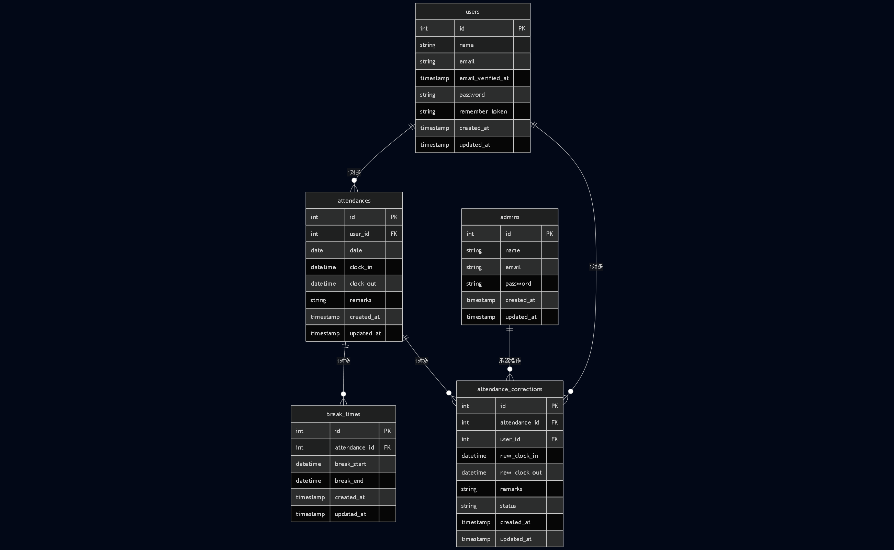

# coachtech 勤怠管理アプリ

## 概要

Laravel + Docker で構築された勤怠管理アプリです。一般ユーザー・管理者の 2 種類のユーザーが存在し、勤怠打刻、勤怠修正申請、管理者による承認などの機能を備えています。

---

## 技術スタック

- Laravel 8
- PHP 7.3/8.0
- MySQL 8
- Docker（nginx, php, mysql, phpmyadmin, mailhog）
- JavaScript（Laravel Mix, app.js）
- Laravel Fortify（認証）
- PHPUnit（テスト）

---

## 主な機能

- 一般ユーザー・管理者の 2 種
- 会員登録・ログイン・メール認証
- 勤怠打刻・勤怠一覧・勤怠詳細
- 勤怠修正申請・申請一覧
- 管理者による勤怠管理・スタッフ管理・修正申請承認

---

## セットアップ手順

1. Docker を起動し、初期セットアップを行います。

```sh
make init
```

- `.env` ファイルは自動で `.env.example` からコピーされます。
- DB 初期化・シーディングも自動で行われます。

2. mailhog でメール送信テストが可能です。
   - Web UI: http://localhost:8025

---

## テスト実行方法

1. マイグレーションとシーディング（テストデータ投入）
2. テスト実行

```sh
docker-compose exec php bash
php artisan migrate:fresh --seed
php artisan test
```

---

## テストアカウント

- 管理者
  - 氏名: テスト管理者
  - email: admin@example.com
  - password: password
- 一般ユーザー 1
  - 氏名: 田中太郎
  - email: tanaka@example.com
  - password: password
- 一般ユーザー 2
  - 氏名: 佐藤花子
  - email: sato@example.com
  - password: password
- 一般ユーザー 3
  - 氏名: 鈴木一郎
  - email: suzuki@example.com
  - password: password
- 一般ユーザー 4
  - 氏名: 高橋美咲
  - email: takahashi@example.com
  - password: password
- 一般ユーザー 5
  - 氏名: 渡辺健太
  - email: watanabe@example.com
  - password: password

---

## DB 構成（主要テーブル）

### users テーブル

| カラム名                  | 型              | 主キー | ユニーク | NOT NULL | 外部キー |
| ------------------------- | --------------- | ------ | -------- | -------- | -------- |
| id                        | unsigned bigint | ○      |          | ○        |          |
| name                      | varchar(255)    |        |          | ○        |          |
| email                     | varchar(255)    |        | ○        | ○        |          |
| email_verified_at         | timestamp       |        |          |          |          |
| password                  | varchar(255)    |        |          | ○        |          |
| two_factor_secret         | text            |        |          |          |          |
| two_factor_recovery_codes | text            |        |          |          |          |
| two_factor_confirmed_at   | timestamp       |        |          |          |          |
| remember_token            | varchar(100)    |        |          |          |          |
| created_at                | timestamp       |        |          |          |          |
| updated_at                | timestamp       |        |          |          |          |

### admins テーブル

| カラム名          | 型              | 主キー | ユニーク | NOT NULL | 外部キー |
| ----------------- | --------------- | ------ | -------- | -------- | -------- |
| id                | unsigned bigint | ○      |          | ○        |          |
| name              | varchar(255)    |        |          | ○        |          |
| email             | varchar(255)    |        | ○        | ○        |          |
| email_verified_at | timestamp       |        |          |          |          |
| password          | varchar(255)    |        |          | ○        |          |
| role              | varchar(255)    |        |          |          |          |
| remember_token    | varchar(100)    |        |          |          |          |
| created_at        | timestamp       |        |          |          |          |
| updated_at        | timestamp       |        |          |          |          |

### attendances テーブル

| カラム名       | 型              | 主キー | ユニーク | NOT NULL | 外部キー  |
| -------------- | --------------- | ------ | -------- | -------- | --------- |
| id             | unsigned bigint | ○      |          | ○        |           |
| user_id        | unsigned bigint |        |          | ○        | users(id) |
| clock_in_time  | timestamp       |        |          | ○        |           |
| clock_out_time | timestamp       |        |          |          |           |
| remarks        | varchar(255)    |        |          |          |           |
| created_at     | timestamp       |        |          |          |           |
| updated_at     | timestamp       |        |          |          |           |

### break_times テーブル

| カラム名         | 型              | 主キー | ユニーク | NOT NULL | 外部キー        |
| ---------------- | --------------- | ------ | -------- | -------- | --------------- |
| id               | unsigned bigint | ○      |          | ○        |                 |
| attendance_id    | unsigned bigint |        |          | ○        | attendances(id) |
| break_start_time | timestamp       |        |          | ○        |                 |
| break_end_time   | timestamp       |        |          |          |                 |
| created_at       | timestamp       |        |          |          |                 |
| updated_at       | timestamp       |        |          |          |                 |

### attendance_corrections テーブル

| カラム名                 | 型              | 主キー | ユニーク | NOT NULL | 外部キー        |
| ------------------------ | --------------- | ------ | -------- | -------- | --------------- |
| id                       | unsigned bigint | ○      |          | ○        |                 |
| attendance_id            | unsigned bigint |        |          | ○        | attendances(id) |
| user_id                  | unsigned bigint |        |          | ○        | users(id)       |
| requested_clock_in_time  | time            |        |          | ○        |                 |
| requested_clock_out_time | time            |        |          | ○        |                 |
| requested_breaks         | json            |        |          |          |                 |
| remarks                  | text            |        |          | ○        |                 |
| status                   | varchar(255)    |        |          |          |                 |
| admin_remarks            | text            |        |          |          |                 |
| created_at               | timestamp       |        |          |          |                 |
| updated_at               | timestamp       |        |          |          |                 |

> ※詳細な制約や最新の定義は `database/migrations` も参照してください。

### ER 図


